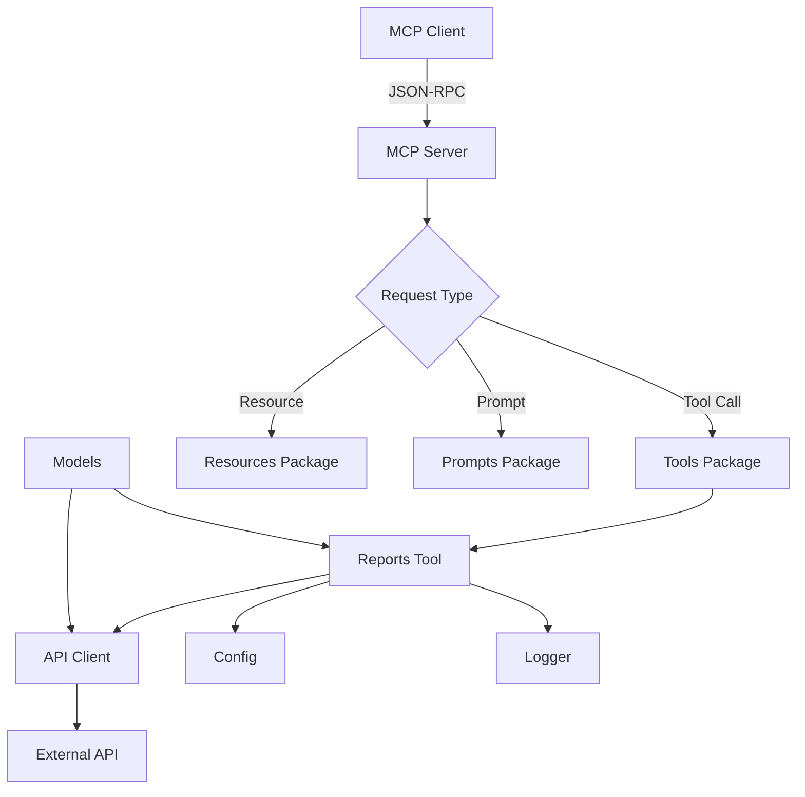

[](https://github.com/rameshsunkara/go-mcp-example/actions/workflows/cibuild.yml)
[](https://goreportcard.com/report/github.com/rameshsunkara/go-mcp-example)

# Go MCP Server Example

A robust Model Context Protocol (MCP) server implementation in Go, featuring analytics reporting tools with idiomatic Go architecture, comprehensive error handling, and enterprise-grade configurability.

## Overview

This project demonstrates a well-structured MCP server that provides analytics reporting capabilities by interfacing with external APIs. It showcases modern Go development practices including dependency injection, structured logging, configuration management, and comprehensive error handling.

## Features

### MCP Protocol Features

1. **Tools**: Analytics report fetching with configurable parameters
2. **Resources**: Extensible resource management system  
3. **Prompts**: Interactive prompt system for enhanced user experience
4. **Error Handling**: Consistent error responses with proper MCP error formatting

### Architecture Features

1. **Idiomatic Go Structure**: Clean separation of concerns with dedicated packages
2. **Dependency Injection**: Testable components with injectable dependencies
3. **Configuration Management**: Environment-based configuration with validation
4. **Structured Logging**: Context-aware logging with slog
5. **Type Safety**: Generated models from OpenAPI specifications
6. **Security**: Secure handling of API keys and sensitive configuration

### Development Features

1. **OpenAPI Integration**: Auto-generated models from API specifications
2. **Testable HTTP Client**: Injectable HTTP client interface for easy mocking
3. **Comprehensive Error Handling**: All errors returned as MCP-compatible responses
4. **Docker Support**: Containerized deployment with multi-stage builds
5. **VS Code Integration**: Configured for seamless MCP server development

## Project Structure

```text
go-mcp-example/
├── main.go                        # Entry point and MCP server setup
├── config/                        # Configuration management
├── models/                        # Data types and API models
├── tools/                         # MCP tools implementation
├── prompts/                       # Interactive prompts
├── resources/                     # MCP resources
├── docs/                          # Documentation and setup guides
│   ├── claude-desktop/            # Claude Desktop configuration
│   └── vscode/                    # VS Code configuration
├── .vscode/                       # VS Code project settings
├── .env.example                   # Environment template
├── Dockerfile                     # Container configuration
├── Makefile                       # Development commands
├── openapi.yaml                   # API specification
└── ...                           # Other config files
```

*See [docs/README.md](docs/README.md) for complete structure details.*

## Architecture Flow



The MCP server handles three types of operations:

1. **Tools**: Execute analytics report fetching with configurable parameters
2. **Resources**: Provide access to static or dynamic resources
3. **Prompts**: Handle interactive prompts for enhanced user experience

## Quick Start

### Prerequisites

- Go 1.24+
- US Data Analytics Program API key ([Get your API key here](https://open.gsa.gov/api/dap/#authentication))
- Make (optional, for convenience commands)
- Docker (optional, for containerized deployment)

### Running the MCP Server

1. **Clone and setup**:

   ```bash
   git clone https://github.com/rameshsunkara/go-mcp-example.git
   cd go-mcp-example
   cp .env.example .env  # Configure your API settings
   ```

   **Important**: Edit the `.env` file and add your API key:

   ```bash
   API_KEY=your-actual-api-key-here
   ```

   Get your API key from: <https://open.gsa.gov/api/dap/#authentication>

2. **Install dependencies**:

   ```bash
   go mod download
   ```

3. **Run the server**:

   ```bash
   # Via stdio (default MCP transport)
   make run
   # OR: go run main.go
   
   # Via HTTP (for debugging)
   make run-http
   # OR: go run main.go --http localhost:8080
   ```

## Client Integration

This project includes pre-configured setups for both VS Code and Claude Desktop. Choose your preferred client:

### VS Code Setup

1. **Build the executable**: `make build`
2. **Copy configurations**: `cp docs/vscode/* .vscode/`
3. **Install MCP Extension**: Install the official MCP extension for VS Code

For detailed instructions, see the [VS Code Setup Guide](docs/vscode/README.md).

### Claude Desktop Setup

1. **Build the binary**: `make build`
2. **Copy configuration**: Copy `docs/claude-desktop/claude-desktop-config.json` to your Claude Desktop config directory
3. **Update paths and API_KEY** in the configuration file
4. **Restart Claude Desktop**

For detailed instructions, see the [Claude Desktop Setup Guide](docs/claude-desktop/README.md).

### Configuration

Configure via environment variables, `.env` file, or VS Code's `.vscode/mcp.json`:

```bash
# API Configuration
API_BASE_URL=https://api.gsa.gov/analytics/dap/v2
API_KEY=your-secret-api-key-here  # Get your API key: https://open.gsa.gov/api/dap/#authentication

# Logging Configuration  
LOG_LEVEL=info                    # debug, info, warn, error
LOG_FORMAT=json                   # json, text

# Server Configuration (optional)
HTTP_ADDR=localhost:8080          # Enable HTTP transport for debugging
```

### Available Tools

#### get_report - Analytics Report Fetching

Fetches analytics reports from the [Digital Analytics Program (DAP) API](https://open.gsa.gov/api/dap/#reports) for U.S. federal government websites.

**Parameters:**

- `report_name` (required): The type of report to fetch
- `limit` (optional): Maximum records (1-10000, default 1000)
- `page` (optional): Page number for pagination (default 1)
- `after`/`before` (optional): Date filters (YYYY-MM-DD format)

**Common Report Types:**

| Report Type | Description |
|-------------|-------------|
| `traffic` | Traffic volume and trends over time |
| `top-pages` | Most visited pages and metrics |
| `devices` | Device usage (desktop, mobile, tablet) |
| `browsers` | Browser usage statistics |
| `countries` | Geographic breakdown by country |
| `realtime` | Real-time active users |

*See tool description for all 12+ available report types.*

**Example Usage:**

```bash
get_report("traffic")                                    # Basic usage
get_report("top-pages", limit=50)                      # With limit
get_report("browsers", after="2024-01-01", before="2024-01-31")  # Date range
```

## Troubleshooting

### Common Issues

#### Empty or No Results from API

The Digital Analytics Program (DAP) API may sometimes return empty results or no data for certain queries. This is a known limitation of the current API endpoint. Common scenarios include:

- **Recent dates**: Very recent data (last 24-48 hours) may not be available yet
- **Specific filters**: Certain combinations of filters may not have data
- **Low-traffic periods**: Some reports may be empty during low-traffic periods
- **API maintenance**: The API may be temporarily unavailable or returning limited data

**Workarounds:**

- Try querying data from a few days ago instead of today
- Use broader date ranges to increase the likelihood of finding data
- Check different report types to see if the issue is report-specific
- Try removing optional filters to get broader results

**Future Plans:**

I am aware of these API reliability issues and are evaluating more stable analytics APIs to provide better data consistency and availability. A migration to a more reliable data source is planned for a future release.

### Development Commands

The Makefile provides convenient development commands:

```bash
# Building and Running
make build                         # Build the MCP server binary
make run                           # Run the server via stdio (default MCP transport)
make run-http                      # Run the server via HTTP (for debugging)

# Testing and Quality
make test                          # Run tests with coverage
make coverage                      # Generate and display coverage report
make lint                          # Run the linter
make lint-fix                      # Run the linter and fix issues
make format                        # Format Go code
make tidy                          # Tidy Go modules
make ci-local                      # Run full CI pipeline locally

# Docker
make docker-build                  # Build Docker image
make docker-run                    # Run containerized server
make docker-clean                  # Clean Docker resources
```

### Docker Deployment

```bash
# Build Docker image
make docker-build

# Run containerized server
make docker-run
```

## Technology Stack

1. **MCP Protocol**: [Model Context Protocol Go SDK](https://github.com/modelcontextprotocol/go-sdk)
2. **Logging**: [slog](https://pkg.go.dev/log/slog) - Structured logging
3. **HTTP Client**: Standard `net/http` with dependency injection
4. **Configuration**: Environment variables with validation
5. **Container**: [Docker](https://www.docker.com/) with multi-stage builds

## Roadmap

- **Enhanced Analytics**: Add support for more analytics endpoints and data sources
- **Caching Layer**: Implement intelligent caching for improved performance
- **Authentication**: Add support for multiple authentication mechanisms
- **Testing**: Comprehensive unit and integration test coverage
- **Monitoring**: Add health checks and metrics collection
- **Documentation**: Auto-generated API documentation from OpenAPI specs

## Contributing

- Feel free to open Pull Requests with improvements
- Create issues for bugs or feature requests  
- Suggestions for architectural improvements are welcome

### What This Is

- A production-ready MCP server template with analytics capabilities
- A showcase of modern Go development practices and patterns
- A foundation for building custom MCP tools and integrations
- A reference implementation for MCP protocol handling in Go

### What This Is Not

- A one-size-fits-all solution (customize it for your specific needs)
